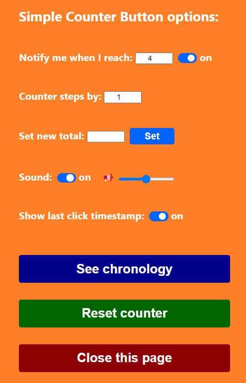

# Simple Counter Button

This was the first Chrome extension I developed. I needed a counter that could be incremented by clicking on a **button on the browser’s toolbar**, but surprisingly I couldn’t find such an extension in the Chrome Web Store.

 

  

 

The counter can be set to step by any value, positive or negative. Default step is +1 per click.

The counter also has a **notification functionality**: it is possible to set a limit and receive a notification when that limit is reached.

 

  

 

Right click on the button and select “Options” to access the options page.

 

  
  

   
  
&nbsp;  

### Stack used:

HTML, CSS, Javascript (Extensions APIs)

&nbsp;
  
### Install here: 

