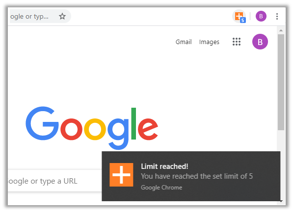

# Simple Counter Button

This was my first Chrome extension. I needed a counter that could be incremented by clicking on a **button on the browser’s toolbar**. 
Surprisingly, I couldn’t find such an extension in the Chrome Web Store, so I made this one.

 

  

 

The counter can be set to step by any value, positive or negative. Default step is +1 per click.

The counter also has a **notification functionality**: it is possible to set a limit and receive a notification when that limit is reached.

 

  

 

Right click on the button and select “Options” to access the options page.

 

  

   
  
&nbsp;  

## Stack used:

HTML, CSS, Javascript (Extensions APIs)

&nbsp;
  
### Chrome Web Store link: 

https://chrome.google.com/webstore/detail/simple-counter-button/ganimlbiphepcnkneheoamhohhmjpohp
